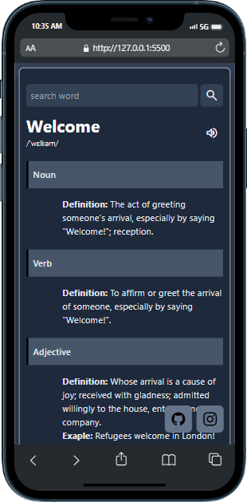

# Dictionary App

This is a Dictionary Web App made using Node JS, tailwind CSS,
and using a api to fetch the data or the meaning of the word.

## Getting Started

Run the command to clone this web app

```
git clone https://github.com/devrudraa/WordMeaning
```

Use the package manager NPM or Yarn to install all the dependencies of this project

```bash
npm install or yarn
```

And at last to start the server run

```bash
npm start
```

### Note

If you want to change the styling you have to start tailwind server (Kind Of) also to run that use

```bash
npm run tailwind
```

and you are good to go!

## Functions

This dictionary has a loading screen when you search the word and a error state if the meaning is not found and a beautiful design to show all the meaning, synonyms, antonyms, examples and different parts of speech.

And also a button to pronounce the word.

It is fully responsive to work with mobile, tablet and desktop

It will help to understand Java Script better as a beginner.

## Screenshots




[Code Mode](https://www.instagram.com/__code_dev)
